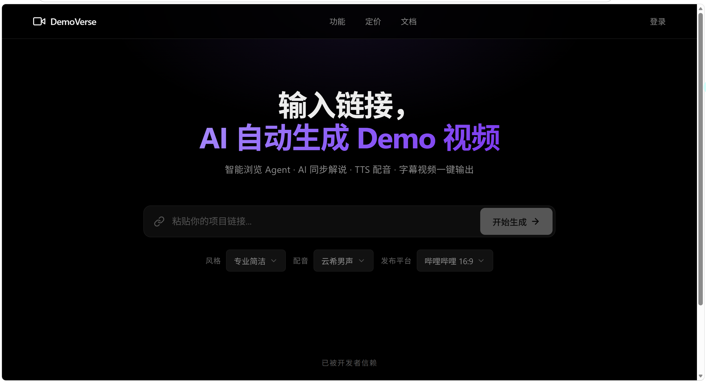

<p align="center">
  
</p>

<h1 align="center">DemoVerse</h1>

<p align="center">
  <strong>AI Demo 视频生成器 — 输入链接，自动生成产品演示视频</strong>
</p>

<p align="center">
  
  
  
  
  
</p>

<p align="center">
  智能浏览 Agent · AI 同步解说 · TTS 配音 · 字幕视频一键输出
</p>

<br/>

## ✨ 功能特性

- 🤖 **智能浏览 Agent** — 自动分析页面结构，规划完整演示路径（导航→功能区→交互→亮点）
- 🎙️ **AI 同步解说** — 产品级解说脚本：开头定位痛点 → 功能详解 → 价值总结
- 🔊 **TTS 语音配音** — 云希男声 / 晓晓女声，分步合成确保音画同步
- 🎬 **专业视频输出** — 标题页 + 完整演示 + 结尾页，自动烧录字幕
- 📐 **多平台适配** — 哔哩哔哩 16:9 / 抖音 9:16 / 小红书 3:4 / YouTube / 视频号 / 知乎
- 🎨 **多风格解说** — 专业简洁 / 轻松亲切 / 活力激情
- ☁️ **云端存储** — 视频自动上传 S3，签名 URL 即时下载

<br/>

## 🚀 快速开始

### 1. 克隆项目

```bash
git clone https://github.com/<your-username>/demoverse.git
cd demoverse
```

### 2. 安装依赖

```bash
# 需要 Node.js 18+, pnpm, FFmpeg, Chromium
pnpm install
```

### 3. 启动服务

```bash
# 设置环境变量
export COZE_API_KEY=your_api_key
export COZE_BUCKET_ENDPOINT_URL=your_s3_endpoint
export COZE_BUCKET_NAME=your_bucket_name

# 启动
node server.js
```

访问 `http://localhost:5000` 即可使用。

<br/>

## 🏗️ 项目结构

```
├── server.js              # Express 主服务器，API 路由 + 视频生成调度
├── lib/
│   ├── agent.js           # 智能浏览 Agent（页面分析+路径规划+交互执行+视觉增强）
│   ├── recorder.js        # Puppeteer 全程录屏（逐帧截图+关键帧+标题页+结尾页）
│   ├── narrator.js        # AI 解说模块（分步 LLM 脚本+分段 TTS+SRT 字幕）
│   ├── video.js           # FFmpeg 视频编译（帧→视频+音频合并+字幕烧录）
│   ├── storage.js         # 对象存储（S3 封装）
│   └── queue.js           # 内存任务队列（Job 生命周期管理）
├── public/
│   ├── index.html         # 前端主页面
│   ├── css/style.css      # 样式（Vercel 极简黑+紫色光晕）
│   └── js/app.js          # 前端交互逻辑
├── assets/                # 项目素材
├── package.json
└── .coze                  # 部署配置
```

<br/>

## 🔄 生成管线

```
URL 输入
  │
  ▼
┌──────────────────────┐
│  智能浏览 Agent       │  Puppeteer 打开页面 → 提取可交互元素
│  (agent.js)          │  LLM 规划演示路径 → 自动点击/滚动/悬停
│                      │  视觉增强注入（高亮光圈、平滑滚动、缩放）
└──────────┬───────────┘
           │ 6-10 步交互动作
           ▼
┌──────────────────────┐
│  AI 解说生成          │  每步独立调用 LLM → 产品级解说脚本
│  (narrator.js)       │  开头定位 + 功能详解 + 价值总结
│                      │  分段 TTS 合成 + SRT 字幕生成
└──────────┬───────────┘
           │ 音频 + 字幕
           ▼
┌──────────────────────┐
│  视频合成             │  逐帧截图 → H.264 编码
│  (video.js)          │  音频分段合并 → 音画同步
│                      │  ASS 字幕烧录 + 标题页/结尾页
└──────────┬───────────┘
           │ MP4
           ▼
┌──────────────────────┐
│  云端存储             │  上传 S3 → 签名 URL 下载
│  (storage.js)        │
└──────────────────────┘
```

<br/>

## 🛠️ 技术栈

| 类别 | 技术 |
|------|------|
| 后端 | Node.js + Express |
| 页面录制 | Puppeteer-core |
| 视频合成 | FFmpeg (H.264 + AAC + ASS) |
| AI 能力 | coze-coding-dev-sdk (LLM + TTS + S3Storage) |
| 前端 | 原生 HTML / CSS / JS |

<br/>

## 🌐 API 接口

| 方法 | 路径 | 说明 |
|------|------|------|
| `POST` | `/api/generate` | 创建视频生成任务 |
| `GET` | `/api/status/:id` | 查询任务状态和进度 |
| `GET` | `/api/jobs` | 获取所有任务列表 |
| `DELETE` | `/api/jobs/:id` | 删除指定任务 |
| `GET` | `/api/download/:id` | 获取视频签名下载链接 |

### 请求示例

```bash
# 生成视频
curl -X POST http://localhost:5000/api/generate \
  -H 'Content-Type: application/json' \
  -d '{
    "url": "https://your-project.com",
    "style": "professional",
    "voice": "yunxi_male",
    "platform": "bilibili"
  }'

# 查询进度
curl http://localhost:5000/api/status/<job-id>
```

### 选项参数

| 参数 | 字段 | 可选值 |
|------|------|--------|
| 风格 | `style` | `professional` / `casual` / `energetic` |
| 配音 | `voice` | `yunxi_male` / `xiaoxiao_female` |
| 平台 | `platform` | `bilibili` / `douyin` / `xiaohongshu` / `youtube` / `wechat` / `zhihu` / `custom` |

<br/>

## 📦 部署

### Docker

```dockerfile
FROM node:18-slim
RUN apt-get update && apt-get install -y ffmpeg chromium && rm -rf /var/lib/apt/lists/*
WORKDIR /app
COPY package.json pnpm-lock.yaml ./
RUN npm install -g pnpm && pnpm install
COPY . .
ENV PUPPETEER_EXECUTABLE_PATH=/usr/bin/chromium
ENV DEPLOY_RUN_PORT=5000
EXPOSE 5000
CMD ["node", "server.js"]
```

### 环境变量

| 变量 | 说明 |
|------|------|
| `COZE_API_KEY` | AI 服务密钥 |
| `COZE_BUCKET_ENDPOINT_URL` | S3 存储 Endpoint |
| `COZE_BUCKET_NAME` | S3 存储桶名 |
| `PUPPETEER_EXECUTABLE_PATH` | Chromium 路径（默认自动检测） |
| `DEPLOY_RUN_PORT` | 服务端口（默认 5000） |

<br/>

## ❓ FAQ

<details>
<summary><strong>支持哪些网站？</strong></summary>
<br>
支持所有可公开访问的网站。SPA 单页应用也能正常录制，Agent 会等待页面加载完成后再分析。
</details>

<details>
<summary><strong>生成的视频多长？</strong></summary>
<br>
标准时长 60-90 秒，根据页面复杂度自动调整。简单页面约 40-60 秒，复杂页面可达 2 分钟。
</details>

<details>
<summary><strong>为什么视频没有声音？</strong></summary>
<br>
请检查 <code>COZE_API_KEY</code> 是否正确配置。TTS 服务需要有效的 API Key。
</details>

<details>
<summary><strong>支持自定义分辨率吗？</strong></summary>
<br>
支持。选择 <code>custom</code> 平台后默认输出 1920x1080，可在 <code>lib/recorder.js</code> 中修改 <code>VIEWPORT_MAP</code>。
</details>

<details>
<summary><strong>可以批量生成吗？</strong></summary>
<br>
可以。通过 API 循环调用 <code>/api/generate</code>，系统内置任务队列管理。
</details>

<br/>

## 📄 许可证

[MIT License](LICENSE)

---

<div align="center">
Made with ❤️ by DemoVerse Team
</div>
